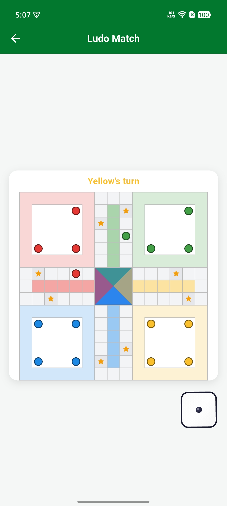
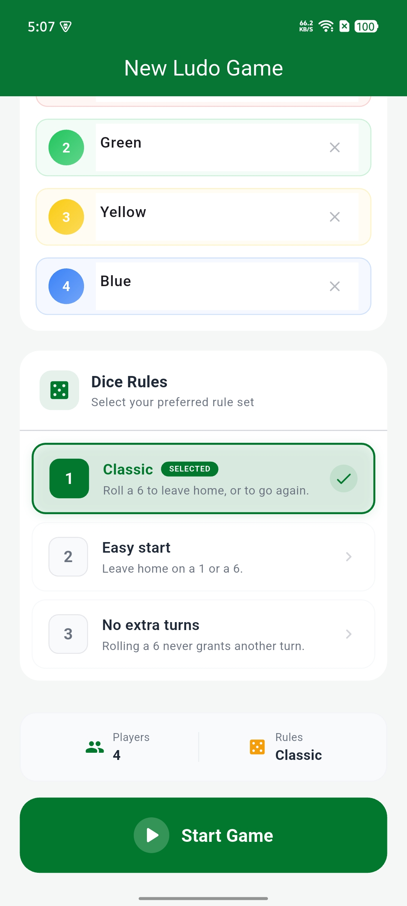

## Screenshots

### Game Board

### Gameplay

Installation

Add the dependency to your pubspec.yaml.

dependencies:
  flutter:
    sdk: flutter
  flutter_ludo: latest_version

  Package Information

This application uses the flutter_ludo package which provides:

Ludo board widget

Piece movement engine

Safe zone logic

Capture rules

Win condition rules

Turn management

Dice support

Game state management